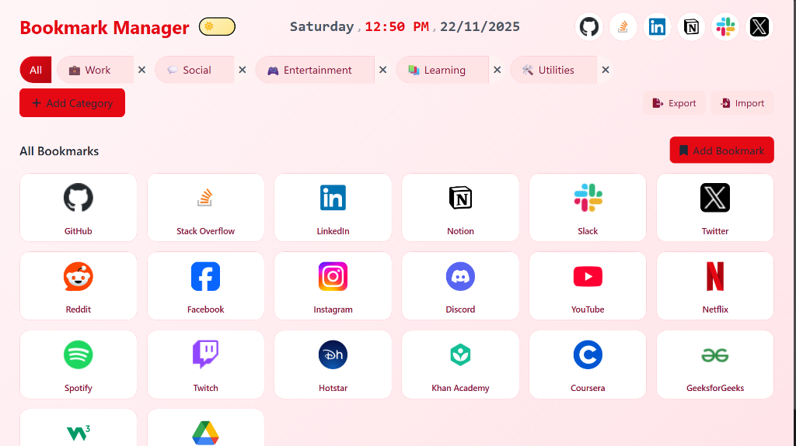

# 🔖 Bookmark Manager

<div align="center">



**A beautiful, feature-rich bookmark manager that replaces your Chrome new tab page**

[](https://github.com/rdxrahul12/Bookmark-Manager-Homepage/releases)
[](LICENSE)
[](https://rdxrahul12.github.io/Bookmark-Manager-Homepage/)

[Features](#features) • [Installation](#installation) • [Usage](#usage) • [Contributing](#contributing)

</div>

---

## ✨ Features

### 🎯 **Smart Organization**
- **Drag & Drop**: Effortlessly move bookmarks between categories
- **Quick Add**: Drag browser tabs or webpage links directly into categories
- **Category Management**: Create, edit, and organize unlimited categories

### 🌓 **Beautiful Themes**
- **Light/Dark Mode**: Toggle with animated sun/moon button
- **Rose-Tinted Light Theme**: Soft pink gradients (#fff5f7, #ffe4e9)
- **Netflix-Inspired Dark Theme**: Sleek black with signature red accents
- **Smooth Transitions**: All components animate beautifully between themes

### 🎨 **Smart Icons**
- **Auto-Generated Fallback Icons**: Beautiful gradient icons with initials
- **Consistent Colors**: Same site always gets the same color scheme
- **Works Offline**: Icons generated locally when favicons fail

### 💾 **Offline-First**
- **Local Storage**: All data stored on your device
- **No Internet Required**: Works completely offline
- **Privacy-Focused**: No tracking, no external servers
- **Import/Export**: Backup and restore your bookmarks

### ⚡ **Performance**
- **Lightweight**: Fast loading and smooth interactions
**Method 1: Manual Add**
1. Click **"Add Bookmark"** button
2. Enter name and URL
3. Select a category
4. Save!

**Method 2: Drag & Drop**
- Drag a browser tab onto any category
- Drag a link from a webpage onto a category
- The bookmark is created automatically with the page title!

### Managing Categories

- **Create**: Click "Add Category" button
- **Edit**: Click the edit icon on any category tab
- **Delete**: Click the X icon on a category tab
- **Reorder**: Categories appear in the order you create them

### Organizing Bookmarks

- **Move**: Drag bookmarks between categories
- **Edit**: Click the edit icon on any bookmark
- **Delete**: Click the trash icon on any bookmark
- **Filter**: Click a category to view only those bookmarks

### Theme Toggle

Click the sun/moon button next to the title to switch between light and dark modes. Your preference is saved automatically!

---

## 🛠️ Development

### Tech Stack

- **Frontend**: Vanilla JavaScript (ES6+)
- **Styling**: Tailwind CSS + Custom CSS
- **Storage**: localStorage API
- **PWA**: Service Worker for offline support
- **Icons**: Font Awesome + Generated fallbacks

### Project Structure

```
├── index.html          # Main HTML file
├── app.js             # Application logic
├── dataManager.js     # Data persistence layer
├── styles.css         # Custom styles
├── sw.js              # Service worker
├── manifest.json      # Extension/PWA manifest
└── README.md          # This file
```

### Local Development

```bash
# Clone the repository
git clone https://github.com/rdxrahul12/Bookmark-Manager-Homepage.git

# Navigate to directory
cd Bookmark-Manager-Homepage

# Serve locally (any static server works)
npx serve .

# Open in browser
# Visit http://localhost:3000
```

### Building for Distribution

```powershell
# Create extension package
mkdir extension-package
Copy-Item manifest.json,index.html,app.js,dataManager.js,styles.css,sw.js extension-package\
Compress-Archive -Path extension-package\* -DestinationPath bookmark-manager-extension.zip -Force
```

---

## 🤝 Contributing

Contributions are welcome! Here's how you can help:

1. **Fork** the repository
2. **Create** a feature branch (`git checkout -b feature/AmazingFeature`)
3. **Commit** your changes (`git commit -m 'Add some AmazingFeature'`)
4. **Push** to the branch (`git push origin feature/AmazingFeature`)
5. **Open** a Pull Request

### Ideas for Contributions

- 🌐 Multi-language support
- 🔍 Search functionality
- 📊 Usage statistics
- 🎨 More theme options
- ☁️ Cloud sync option
- 📱 Mobile app version

---

## 📝 License

This project is licensed under the MIT License - see the [LICENSE](LICENSE) file for details.

---

## 🙏 Acknowledgments

- Inspired by Netflix's UI design
- Icons by [Font Awesome](https://fontawesome.com/)
- Built with ❤️ for productivity enthusiasts

---

## 📞 Support

- **Issues**: [Report a bug](https://github.com/rdxrahul12/Bookmark-Manager-Homepage/issues)
- **Discussions**: [Join the conversation](https://github.com/rdxrahul12/Bookmark-Manager-Homepage/discussions)
- **Documentation**: [Installation Guide](QUICK-START.md)

---

<div align="center">

**Made with ❤️ by [rdxrahul12](https://github.com/rdxrahul12)**

⭐ Star this repo if you find it useful!

</div>
